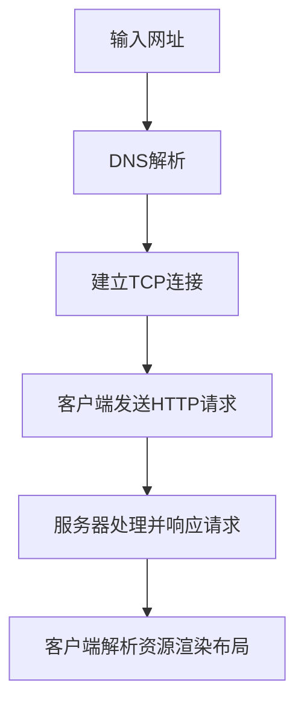
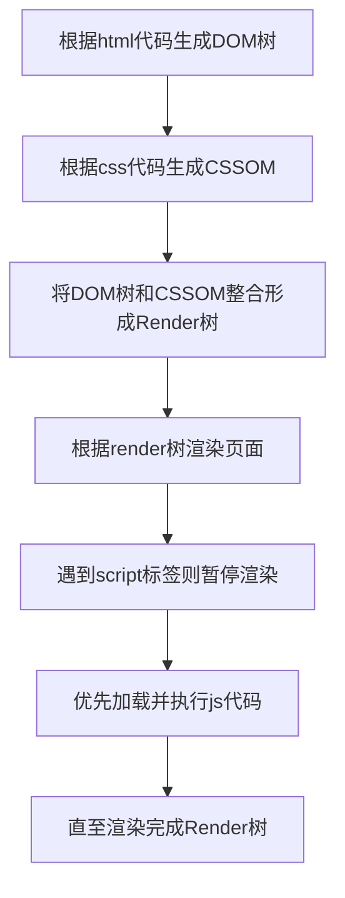
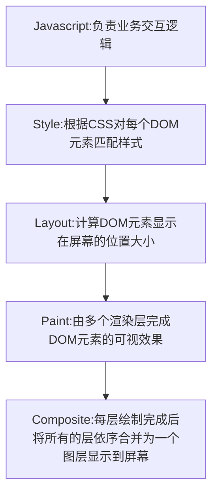

# 浏览器
## 屏幕刷新频率
屏幕每秒出现图像的次数。*(普通笔记本为60Hz)*

## 动画原理
计算机每16.7ms刷新一次，由于人眼的视觉停留，所以看起来是流畅的移动

## 实现动画的方式
1. HTML5：Canvas动画 / requestAnimationFrame API
2. CSS3：transition / animation；
3. JS：setTimeout / setInterval
4. SVG（可伸缩矢量图形）

## `requestAnimationFrame`（rAF）请求动画帧
优势：
由系统决定回调函数的执行时机。60Hz的刷新频率，那么每次刷新的间隔中会执行一次回调函数，不会像setTimeout那样容易卡顿、抖动、引起丢帧

*优点：CPU节能、函数节流      
缺点：容易考虑优雅降级*

## `clientHeight`,`scrollHeight`,`offsetHeight`,以及`scrollTop`, `offsetTop`,`clientTop`

## `LocalStorage`、`SessionStorage`、`Cookie`的区别：
<table >
			<tr>
				<th></th>
				<th align="center">LocalStorage</th>
				<th align="center">SessionStorage</th>
				<th align="center">Cookie</th>
			</tr>
			<tr>
				<td>存储位置</td>
				<td colspan="3" align="center">客户端</td>
			</tr>
			<tr>
				<td>存储类型</td>
				<td colspan="3" align="center">字符串</td>
			</tr>
			<tr>
				<td>增删改查</td>
				<td colspan="3" align="center">set、get、remove</td>
			</tr>
			<tr>
				<td>存储大小</td>
				<td align="center">5M</td>
				<td colspan="2" align="center">4K</td>
			</tr>
			<tr>
				<td>有效期</td>
				<td align="center">永久：需手动清除</td>
				<td align="center">仅当前会话有效</td>
				<td align="center">在设置的有效期后过期</td>
			</tr>
			<tr>
				<td>与服务端通信</td>
				<td colspan="2" align="center">×</td>
				<td align="center">携带在HTTP请求头信息中</td>
			</tr>
			<tr>
				<td>页面共享</td>
				<td align="center">√</td>
				<td align="center">不同顶级窗口不共享</td>
				<td align="center">同域名不同端口可共享</td>
			</tr>
            <tr>
				<td>易用性</td>
				<td colspan="2" align="center">可以接受原生/封装接口，对Object/Array支持更好</td>
				<td align="center">原生接口不友好，需要手动封装</td>
			</tr>
		</table>

## Cookie和Session
|                | Cookie                               | Session                      |
| -------------- | ------------------------------------ | ---------------------------- |
| 是否安全       | √                                    | ×                            |
| 储存限制       | ≤4K                                  | /                            |
| 位置           | 客户端                               | 服务器端                     |
| 保存的数据类型 | 字符串                               | 任意类型                     |
| 语法           | `if(request.Cookies["admin"]!=null)` | `if(session["admin"]!=null)` |
1. Cookie 在客户端，Session 在服务器端。
2. Cookie的安全性一般，他人可通过分析存放在本地的Cookie并进行Cookie欺骗。在安全性第一的前提下，选择Session更优。重要交互信息比如权限等就要放在Session中，一般的信息记录放Cookie就好了。
3. 单个Cookie保存的数据不能超过4K，很多浏览器都限制一个站点最多保存20个Cookie。
4. Session 可以放在文件、数据库或内存中，比如在使用Node时将Session保存在redis中。由于一定时间内它是保存在服务器上的，当访问增多时，会较大地占用服务器的性能。考虑到减轻服务器性能方面，应当适时使用Cookie。
5. Session 的运行依赖Session ID，而 Session ID 是存在 Cookie 中的，也就是说，如果浏览器禁用了 Cookie，Session 也会失效（但是可以通过其它方式实现，比如在 url 中传递 Session ID）。
6. 用户验证这种场合一般会用 Session。因此，维持一个会话的核心就是客户端的唯一标识，即Session ID。

## web worker 
运行在后台的 JavaScript，独立于其他脚本，不会影响页面的性能

## Ajax
**创建交互式、快速动态网页应用的网页开发技术，无需重新加载整个网页的情况下，能够更新部分网页的技术**

优点：减轻服务器的负担,按需取数据,最大程度的减少冗余请求，局部刷新页面,减少用户心理和实际的等待时间,带来更好的用户体验，基于xml标准化,并被广泛支持,不需安装插件等，进一步促进页面和数据的分离

缺点：因为大量的使用了`JS`和`AJAX`引擎,这些取决于浏览器的支持.在编写的时候考虑对浏览器的兼容性。

## Web安全色

## URL到整个页面加载完毕显示在屏幕上的整个流程

## 页面渲染过程
解析HTML、构建DOM树、DOM树与CSS样式进行附着构造呈现树、布局、绘制

## 页面展示过程

# 框架
## 单向数据流和双向数据流

|      | 单向数据流                                                                                                                                                                                                                                                                                           | 双向数据流                                                   |
| ---- | ---------------------------------------------------------------------------------------------------------------------------------------------------------------------------------------------------------------------------------------------------------------------------------------------------- | ------------------------------------------------------------ |
| 架构 | MVC                                                                                                                                                                                                                                                                                                  | MVVM                                                         |
| 框架 | React                                                                                                                                                                                                                                                                                                | Vue、Angular                                                 |
| 例子 | Vue 中 v-bind 、父传子的 props                                                                                                                                                                                                                                                                       | Vue 中 v-model                                               |
| 特点 | 所有状态的改变可记录、可跟踪，源头易追溯； 一旦数据变化，就去更新页面(data-页面)，但是没有(页面-data)； 如果用户在页面上做了变动，那么就手动收集起来(双向是自动)，合并到原有的数据中； 所有数据只有一份，组件数据只有唯一的入口和出口，使得程序更直观更容易理解，有利于应用的可维护性 | 无论数据改变，或是用户操作，都能带来互相的变动，并且自动更新 |

## `Vue`和`React`
# 架构
## RESTful 
一种网络应用程序的设计风格和开发方式，基于HTTP，可以使用XML格式定义或JSON格式定义（用 URL 定位资源，用 HTTP 描述操作）
## MVC和MVVM
> MVC：在Controller里面把Model的数据赋值给View

# 性能优化
## 页面加载及渲染优化
1. HTML：文档结构层次尽量少（最好不深于六层）
2. CSS：样式结构层次尽量简单；少量首屏样式内联放在标签内；动画尽量使用在绝对定位或固定定位的元素上；隐藏在屏幕外，或在页面滚动时，尽量停止动画；
3. JS：在脚本中尽量减少DOM操作，尽量缓存访问DOM的样式信息，避免过度触发回流；减少通过JavaScript修改元素样式，尽量使用修改class名方式操作样式/动画；尽量缓存DOM查找，查找器尽量简洁；
4. CSS置顶，JS置底；涉及多域名的网站开启域名预解析
5. 静态资源使用CDN
6. 使用字体图标、精灵图
7. 利用缓存减少重复加载
## 页面交互优化
### 懒加载
可以通过为图片文件添加loading="lazy"的属性来实现
### 节流防抖
#### 节流
触发高频事件，但在n秒内只会执行一次，在于稀释函数的执行频率

*（就像游戏里无论手速多快，多次平A也有频率上限）*
#### 防抖
触发高频事件后，n秒内只会执行一次，如果n秒内高频事件再次被触发，则重新计算时间

*（就像游戏里释放技能的时候，再按一次技能就会重新冷却）*
# 服务器
## 服务的有状态和无状态
都是负载均衡服务

**判断两个来自相同发起者的请求在服务器端是否具备上下文关系**
|          | 有状态                   | 无状态                         |
| -------- | ------------------------ | ------------------------------ |
| 数据同步 | 需要                     | /                              |
| 资源消耗 | 保存数据                 | /                              |
| 带宽消耗 | 数据同步                 | /                              |
| 部署发布 | 需要额外的数据同步       | 直接部署                       |
| failover | 数据可能丢失，同步不完全 | 数据不会丢失，负载均衡失效转移 |
